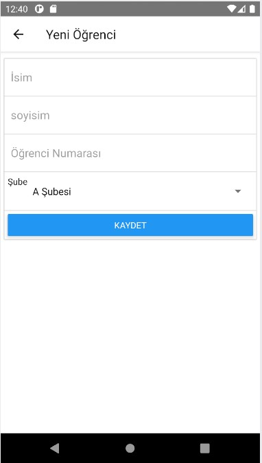

# Student Register
> React Native mobile project for studying.

## Core Technologies
> React Native

## Plugins
> react-native-redux, axios, react-native-router-flux

## Database
> Google Firebase

## For check android app on android device
> Install .apk file under build folder.

## Build Setup
``` bash
# for link to database => create firebase.js under private folder and insert
import firebase from 'firebase';
const firebaseConfig = {[YOUR_FIREBASE_CONFIGS]};
export default firebase.initializeApp(firebaseConfig);

# install dependencies
$ npm install

# dev server up for testing
$ npm start

# you would test application on ios or android emulators.
```

## Previews
> Login Screen    


> Student List    


> Add New Student    


> Student Details   

